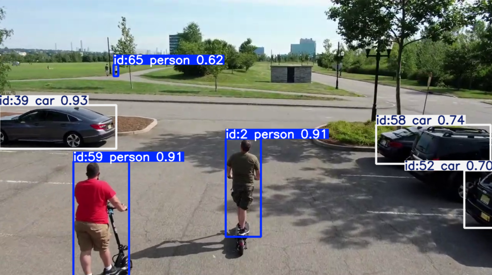

# YOLO Drone AI: Real-Time Object Tracking and Reidentification 🎥🚁

A cutting-edge project leveraging YOLO AI to detect, track, and reidentify objects like people and scooter riders in real-time drone footage. The primary focus is to showcase how objects can be reidentified after occlusion, ensuring accurate and persistent tracking over time.

---

## Features

- **🔍 Advanced Object Detection**: Detects people and scooter riders in real-time using the YOLO model.
- **🎯 Persistent Object Tracking**: Tracks objects across frames and maintains unique IDs for each target.
- **♻️ Reidentification After Occlusion**: Reassociates objects even after they leave the frame temporarily.
- **📏 Distance Estimation**: Calculates the real-world distance of tracked objects using bounding box dimensions.
- **🖼️ Annotated Visualization**: Outputs video frames with detailed bounding boxes, labels, and tracking indicators.
- **🎥 Debugging Outputs**: Saves frames and tracking information to aid in debugging and performance evaluation.

---

## Demo

🎥 **Watch the Demo on YouTube**: [Real-Time Drone Object Tracking Demo](https://youtu.be/OPLMFraQvr0)  


---

## Requirements

Ensure you have Python installed, then install the following dependencies:

```bash
pip install ultralytics opencv-python-headless numpy scikit-image
